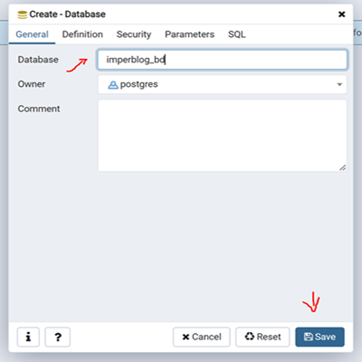
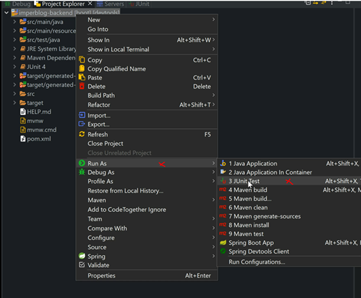
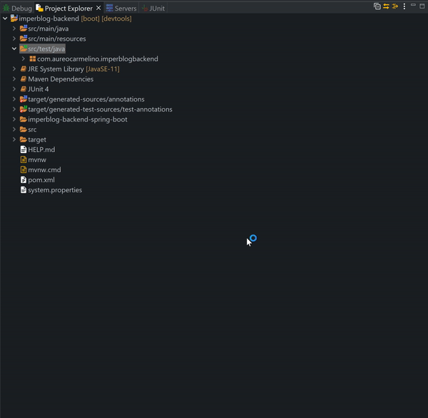
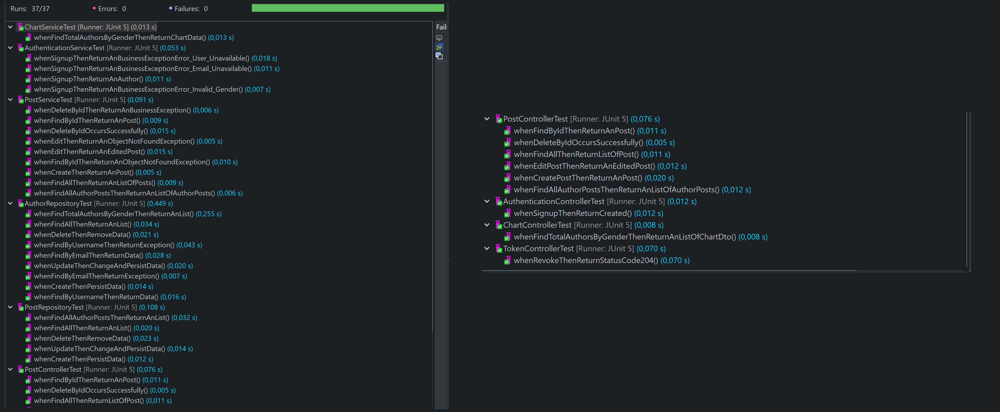
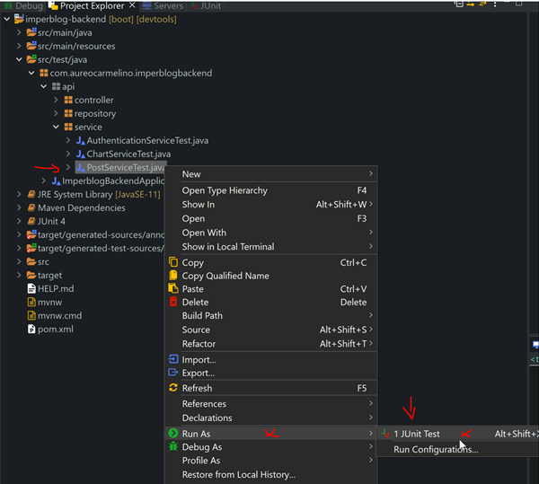
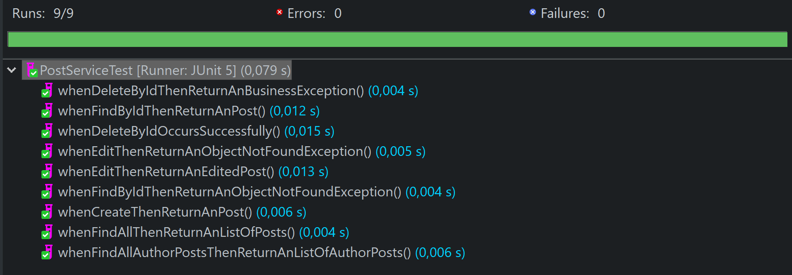
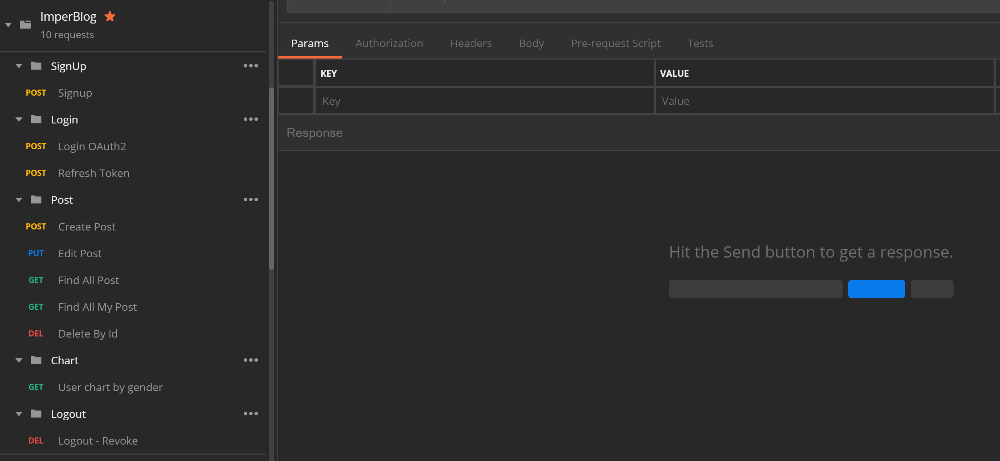

# FullStack App ( Spring + Angular ) : ImperBlog :bookmark_tabs:

 **1) ENGLISH**

Application for creating blog posts, developed with Java using Spring Framework for backend and Angular along with PrimeNG Library for frontend development.

 **1) PORTUGUESE**

 Aplicação para a criação de postagens ao estilo BLOG, desenvolvida com Java utilizando o Spring Framework para o backend e o Angular juntamente com a Biblioteca PrimeNG para o desenvolvimento frontend. 

 **2) ENGLISH**

###### `The App has the following features:`

1. Creating a user account
2. Login access validation using Spring Security
3. Creating multiple posts per user
4. Listagem de todas as postagens na página inicial
5. Listing of all posts on the homepage
6. view a post
7. Edit a logged-in user's post
8. Delete a post from the logged in user
9. View the graph of users by gender (M & F)
9. Responsive design suitable for most devices
10. Logout
11. JWT Token Usage
12. Update token automatically
13. Frontend URL protection
14. Redirection to login when token expires
14. Backend unit tests in Controllers, Services and Repositories classes
15. And additional features or functionality in both Backend and Frontend for better user usability

**2) PORTUGUESE**

**`O App conta com as seguintes funcionalidades:`**

1. Criação de uma conta de utilizador
2. Validação de acesso com login utilizando Spring Security
3. Criação de várias postagens por utilizador
4. Listagem de todas as postagens na página inicial
5. Listagem de todas as postagens de um utilizador no seu perfil
6. Visualizar uma postagem
7. Editar uma postagem do utilizador logado
8. Deletar uma postagem do utilizador logado
9. Visualizar o gráfico de utilizadores por gênero ( M & F )
9. Design Responsivo adequado para a maioria dos dispositivos
10. Logout
11. Utilização do Token JWT
12. Refresh Token automático
13. Proteção de URL's no frontend
14. Redirecionamento para o login quando o token expira
15. Testes unitários no Backend nas classes dos Controllers, Services e Repositories
16. E recursos ou funcionalidades adicionais tanto no Backend como no Frontend para melhor usabilidade do usuário

**EN:	The final system is available for testing at:**  **[https://imperblog.vercel.app/](https://imperblog.vercel.app/)**

**PT:	O sistema final encontra-se disponível para teste em :**  **[https://imperblog.vercel.app/](https://imperblog.vercel.app/)**

 
    

# :key: **EN:**	Requirements to run on Localhost

# :key: **PT:**	Requisitos para executar em Localhost 

1. **Java Jdk** ( **8/11** )
2. **Spring Tools Suit** | **Eclipse IDE** | **IntelliJ IDEA** | **NetBeans** :  Backend
3. **VScode**:  Frontend
4. **PostMan**
5. **Node Js & npm**
6. **TypeScript**
7. **Angular CLI** 
8. **PgAdmin 4 & PostgreSQL**
9. **Maven**

# :interrobang: **EN:**	Note ( Database creation )   

1. It is important that you first create the database with the name **imperblog_bd** before running the backend if you have **PgAdmin 4** & **PostgreSQL** installed on your machine as shown in the following image:

# :interrobang: **PT:**	Observação ( Criação do banco de dados ) 

1. É importante que primeiramente crie o banco de dados com o nome **imperblog_bd** antes de executar o backend  caso tenha o **PgAdmin 4** & **PostgreSQL** instalados na sua máquina como mostra a imagem a seguir:

 
    

**EN**

1. When starting the backend application, the database will automatically be loaded with the respective tables defined in `imperblog-backend/src/main/db/migration`
2. If you want to change the name of the database, create one of your choice and remember to change it in the properties file `application.properties` located in the directory `imperblog-backend/src/main/resources ` on line 1 `spring.datasource.url=jdbc:postgresql://127.0.0.1:5432/your-database-name` 

**PT**

1. Ao iniciar a aplicação backend , automaticamente o banco de dados será carregado com as respetivas tabelas definidas em `imperblog-backend/src/main/db/migration` 
2. Caso deseje alterar a nome do banco de dados, crie um a sua escolha e lembre-se de alterá-lo no ficheiro de propriedades  `application.properties` que encontra-se no diretório `imperblog-backend/src/main/resources` na linha nº 1 `spring.datasource.url=jdbc:postgresql://127.0.0.1:5432/nome-do-seu-banco-de-dados`  

# :computer: **EN:**	Installation :computer_mouse:

**To perform the installation, you must have a good internet connection and follow the steps below** :arrow_down_small:

1. **Downloading files from GitHub** : In **Code** use the **Download ZIP** option to **download** the entire repository.
2. **Unzip the downloaded file**.
3. **Open the `imperblog-backend` directory** in your preferred backend IDE and wait for Maven to import/download the dependencies.
4. **Run the project** `imperblog-backend` **so that it is available at `localhost:8080`** .
5. **Open the directory** `imperblog-frontend` in your preferred frontend IDE, and at the root of the directory, open the command line and run the command `npm install` to install the Angular framework dependencies and PrimeNG.
6. Run, typing in **GitBash** the command `ng serve -o` in the root of the `imperblog-frontend` project, so that the application starts and the browser automatically opens or type `ng serve` and access the url o address: `http://localhost:4200`.
7. If everything is perfectly installed, accessing the url `http://localhost:4200` will have access to the Login as shown in the following image:

# **PT:**	Instalação :computer_mouse:

**Para realizar a instalação, é necessário possuir uma boa conexão com a internet e seguir os passos a baixo** :arrow_down_small:

1. **Baixando os arquivos do GitHub** : Em **Code** use a opção **Download ZIP** para **baixar** todo o repositório. 
2. **Descompactar o arquivo baixado**.
3. **Abrir o diretório**  `imperblog-backend` em sua IDE backend preferida e esperar que o Maven faça o import/download das dependências.
4. **Executar o projecto**  `imperblog-backend`  **para que o mesmo fique disponível em `localhost:8080`** .
5. **Abrir o diretório**  `imperblog-frontend` em sua IDE frontend preferida , e na raiz do diretório, abra a linha de comando e execute o comando`npm install` para que se faça a instalação das dependências do  framework Angular e PrimeNG .
6. Execute, digitando no **GitBash** o comando `ng serve -o` na raiz do projeto `imperblog-frontend`  , para que a aplicação inicie e o browser abra automaticamente ou digite  `ng serve` e aceda na url o endereço:  `http://localhost:4200`.
7. Caso tudo esteja perfeitamente instalado ao aceder a url  `http://localhost:4200` terá acesso ao Login como mostra a imagem a seguir:

 
    

# :computer: **EN:**	Unitary tests :bar_chart:

**Unit tests are in the directory:** `imperblog-backend/src/test/java`

To run all tests in **simultaneous** do as shown in the following image:arrow_down_small:

# :computer: **PT:**	Testes Unitários :bar_chart:

**Os testes unitários encontram-se no diretório:** `imperblog-backend/src/test/java`

Para executar todos os testes em **simultâneo** faça como mostra a imagem a seguir :arrow_down_small:

 
    

**EN:**   And as a result we will have all the tests executed :arrow_down_small:

**PT:**	E como resultado teremos todos os testes executados :arrow_down_small:

 
    

 
    

**EN:**	To run the tests of a specific class, in which we will use the **PostServiceTest** class as an example, do as shown in the following image :arrow_down_small:

**PT:**	Para executar os testes de uma classe específica, em que utilizaremos a classe **PostServiceTest** como exemplo faça como mostra a imagem a seguir :arrow_down_small:

 
    

**EN:**	And as a result we will have only the tests of the **PostServiceTest** class executed :arrow_down_small:

**PT:**	E como resultado teremos somentes os testes da classe **PostServiceTest** executados :arrow_down_small:

 
    

# :computer: Postman Collection :satellite:

`/postman_collection`

 
    

**EN:	I'll be adding new features as time goes on, I hope you like it**  :heart: :happy:

**PT:	Vou adicionando novas funcionalidades consoante o tempo, espero que tenham gostado** :heart: :happy:

# SEJA LUZ :bulb: 		BE LIGHT:bulb: 

